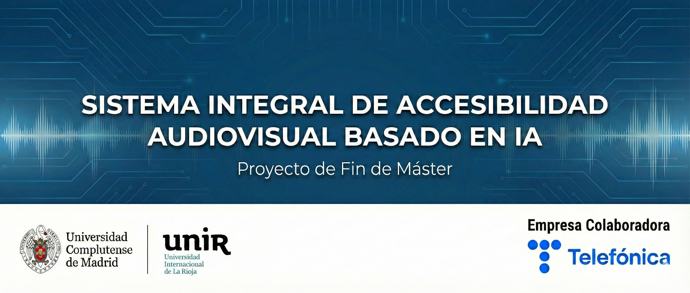

<p align="center">
  
</p>

# Sistema Integral de Accesibilidad Audiovisual basado en IA

Este repositorio contiene el código fuente del Proyecto de Fin de Máster desarrollado en el marco del Programa Tutoría de Telefónica por estudiantes del **Máster en Letras Digitales** de la Universidad Complutense de Madrid (UCM) y el **Máster en Inteligencia Artificial** de la Universidad Internacional de La Rioja (UNIR).

El sistema implementa un pipeline automatizado diseñado para mejorar la accesibilidad de contenidos audiovisuales mediante el uso de Inteligencia Artificial Generativa y Visión Artificial. El software procesa vídeos para generar subtítulos enriquecidos que incluyen:

1.  **Transcripción automática** del habla (Speech-to-Text).
2.  **Diarización visual de hablantes**: Identificación de *quién* habla basándose en reconocimiento facial y sincronización labial (*lip-sync*), no solo en la voz.
3.  **Traducción automática neuronal** a múltiples idiomas.
4.  **Fusión multimodal**: Generación de archivos de subtítulos duales y etiquetados por hablante.

## 🛠️ Arquitectura

El sistema procesa archivos `.mp4` a través de las siguientes etapas secuenciales:

1.  **Audio Processing:** Extracción y transcripción (`Whisper`).
2.  **Face Analysis:** Detección (`InsightFace`) + Clustering (`DBSCAN`) + Detección de Hablante Activo.
3.  **NLP Pipeline:** Traducción neuronal (`Helsinki-NLP`).
4.  **Multimodal Fusion:** Sincronización de texto, identidad visual y tiempos.

## 📦 Requisitos e Instalación

Este proyecto ha sido optimizado para ejecutarse en entornos con recursos limitados (**CPU**), democratizando el acceso a herramientas de accesibilidad sin necesidad de GPUs dedicadas de alto rendimiento.

### Prerrequisitos
*   **Python 3.9+**
*   **FFmpeg** instalado en el sistema.
*   Se recomienda un mínimo de **8 GB de RAM** (16 GB recomendados para el modelo Large de Whisper).

### Instalación
Clona el repositorio e instala las dependencias necesarias:

```bash
git clone [https://github.com/aramos-m/TFM-Telefonica.git](https://github.com/aramos-m/TFM-Telefonica.git)
cd TFM-Telefonica

# Se recomienda crear un entorno virtual
python3 -m venv venv
source venv/bin/activate  # En Windows: venv\Scripts\activate

# Instalación de librerías (Torch CPU por defecto)
pip3 install -r requirements.txt
```

## ⏯️ Ejecución

1.  **Preparación de datos:**
    Coloca los vídeos `.mp4` que deseas procesar en la carpeta `data/`.
    ```text
    ├── data/
    │   ├── ejemplo1.mp4
    │   └── ejemplo2.mp4
    ```

2.  **Ejecutar el pipeline:**
    ```bash
    python main.py
    ```

El pipeline automático hará lo siguiente para cada vídeo en `data/`:  
1. Convertir `.mp4` → `.wav`.  
2. Transcribir el audio a subtítulos en español (`*_es.srt`).  
3. Detectar caras y segmentos de habla (`*_faces_detections.csv`, `*_talking_faces.srt`).  
4. Traducir los subtítulos al inglés (`*_en.srt`).  
5. Fusionar subtítulos español+inglés y asignar hablantes (`*_esen_diarizado.srt`).  

---

## 📂 Resultados

Los archivos resultantes se guardan en el directorio `outdir/`. Para cada vídeo procesado, obtendrás:

| Archivo | Contenido |
| :--- | :--- |
| `*_es.srt` | Transcripción original en español. |
| `*_en.srt` | Traducción al inglés (o idioma seleccionado). |
| `*_talking_faces.srt` | Segmentos de tiempo con caras hablando detectadas. |
| `*_faces_detections.csv` | Datos técnicos de detección facial y embeddings. |
| **`*_esen_diarizado.srt`** | **Archivo Final:** Subtítulos bilingües con identificación de hablante (e.g., `SPEAKER_1`). |

---

## 🌍 Idiomas Soportados

El módulo de traducción utiliza **MarianMT** y soporta la traducción desde Español a una amplia variedad de idiomas, incluyendo:

| Europa Occ. / Norte | Código | Europa Or. / Otros | Código | Asia / Oriente Medio | Código |
| :--- | :---: | :--- | :---: | :--- | :---: |
| 🇩🇪 Alemán | `de` | 🇵🇱 Polaco | `pl` | 🇨🇳 Chino (Simp.) | `zh-hans`|
| 🇫🇷 Francés | `fr` | 🇺🇦 Ucraniano | `uk` | 🇯🇵 Japonés | `ja` |
| 🇮🇹 Italiano | `it` | 🇨🇿 Checo | `cs` | 🇰🇷 Coreano | `ko` |
| 🇵🇹 Portugués | `pt` | 🇷🇴 Rumano | `ro` | 🇷🇺 Ruso | `ru` |
| 🇳🇱 Holandés | `nl` | 🇬🇷 Griego | `el` | 🇸🇦 Árabe | `ar` |
| 🇸🇪 Sueco | `sv` | 🇹🇷 Turco | `tr` | 🇮🇱 Hebreo | `he` |
| 🇩🇰 Danés | `da` | | | | |

Para cambiar el idioma destino, modifica el primer parámetro en la función [`translate_srt_to`](main.py).

---

© 2025 - TFM Máster Letras Digitales (UCM) & Máster IA (UNIR) - Programa Tutoría Telefónica.
